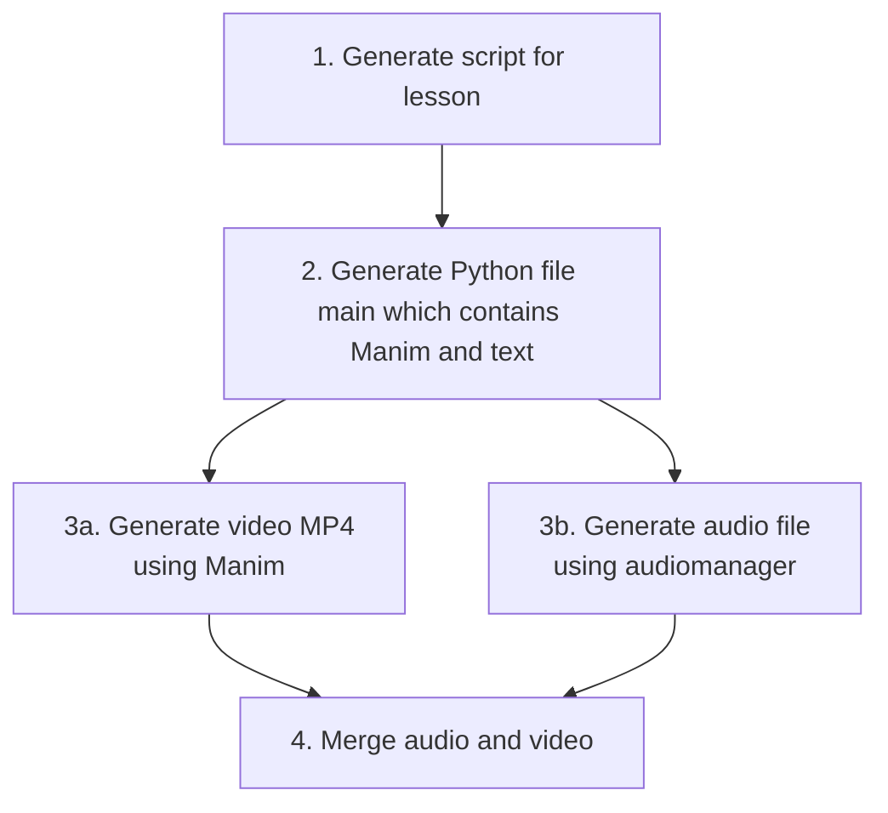

# AI Courses

## TODOs
- Upgrade TTS to Qwen3 (maybe have alternative for test/prod?)

    - https://huggingface.co/spaces/Qwen/Qwen3-TTS
Prompt
Speak as a math professor, smart, wise, but compassionate, understanding that students dont currently posess all of his knowlege

- Fix a data pipeline from a concept, so that a model can use RAG, generate a script and pass it onto a model that generates the video

- Correlate color with beräkningar

## Pipeline Overview

