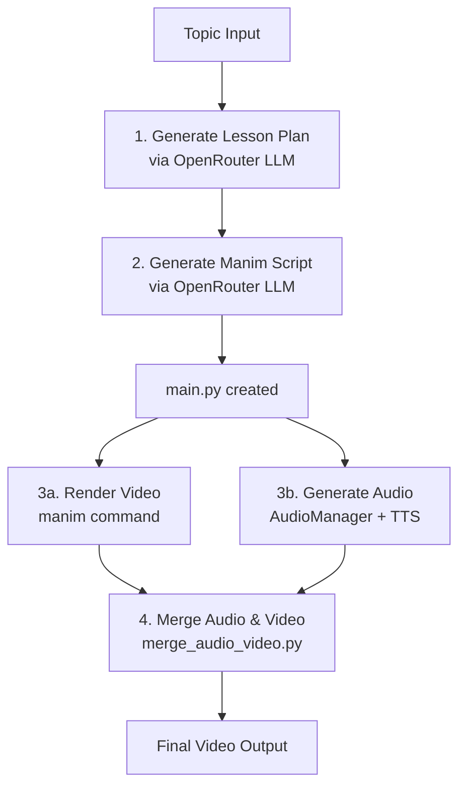

# AI Courses

Automated pipeline for generating educational math videos using AI and Manim.

## Quick Start

### Automated Script Generation

Generate a complete Manim script automatically using OpenRouter:

```bash
# Generate a lesson and Manim script in one command
python generate_course.py "Course Name"
```

**Example usage:**
```python
from generate_course import CourseWorkflow

workflow = CourseWorkflow()
workflow.run_full_pipeline(
    topic="QR Decomposition",
    output_script="main.py",
    output_lesson="lesson.md"  # optional
)
```

This will:
1. Generate a structured lesson plan for the topic
2. Create a complete Manim Python script in `main.py`
3. Ready to render with: `manim -pql main.py [SceneName]`

### Manual Process (Legacy)

If you prefer manual control, you can still:
1. Run `create_lesson/lesson_planner.py` to generate lesson content
2. Manually create/edit `main.py` with Manim code

## Environment Setup

1. Copy `.env.example` to `.env` (if available) or create `.env`:
```env
OPENROUTER_API_KEY=your_key_here
```

2. Install dependencies:
```bash
uv sync
```

## Text-to-Speech (Qwen3-TTS)

Audio narration is generated locally using **[Qwen3-TTS](https://github.com/QwenLM/Qwen3-TTS)**.

### Installation

```bash
uv sync                   # installs qwen-tts and other deps
# optional: FlashAttention 2 for lower VRAM usage on CUDA
uv run pip install flash-attn --no-build-isolation
```

### Environment variables

| Variable | Default | Description |
|---|---|---|
| `QWEN_TTS_MODEL` | `Qwen/Qwen3-TTS-12Hz-1.7B-CustomVoice` | HuggingFace model ID |
| `QWEN_TTS_SPEAKER` | `Ryan` | Built-in speaker name |
| `QWEN_TTS_LANGUAGE` | `English` | Language passed to the model |
| `QWEN_TTS_INSTRUCT` | *(professor prompt)* | Style instruction for the voice |
| `AUDIO_OUTPUT_DIR` | `.cache/audio` | Directory for individual WAV clips and merged audio |

### Running the tests

```bash
uv run pytest tests/test_audiomanager.py -v
```

End-to-end integration test:

```bash
uv run pytest tests/test_audiomanager.py -v -m integration
```

## Pipeline Overview



## Configuration

Edit `generate_course.py` to customize:
- **Planning Model**: Cheap model for lesson structure (default: `liquid/lfm-2.5-1.2b-thinking:free`)
- **Script Model**: Code-capable model for Manim generation (default: `google/gemini-2.0-flash-exp:free`)
- **Course Code**: Change the course identifier (default: `FMNF05`)

## TODOs
- Add RAG search for previous exam problems
- Correlate colors with calculations
- Add self-correcting execution loop for Manim code (retry on errors)
