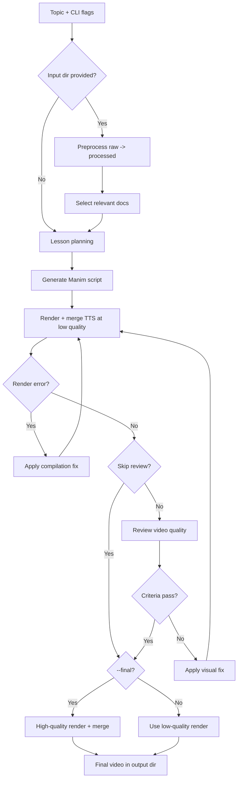

# Grasp


**Turn any university course into high quality video lessons - 100% automatically**

Website: [grasp-team.se](https://grasp-team.se)
YouTube: [@grasp-team](https://www.youtube.com/@grasp-team)

## Problem Statement

University is broken for most students.

- **One teacher for 200 students.** Lectures move at one speed - too fast for some, too slow for others. There's no way to personalize at scale.
- **Disengaged teaching.** Many lecturers would rather do research. The result: recycled 10-year-old slides and labs, and feedback that goes nowhere.
- **Canvas is a mess.** No standards for course structure. Students are buried under hundreds of slide pages and 1,000+ page textbooks.

Overall, students waste enormous amounts of time - and it doesn't have to be this way.

## Solution

Grasp takes raw course materials and transforms them into concise, animated explainer videos optimized for learning and exam results.

1. **Upload** all course materials - slides, exams, labs, textbooks.
2. **AI analysis** - a data pipeline processes each file type and an AI agent analyzes the content to create a structured learning plan.
3. **Animated video** - a Python animation script is generated and rendered using Manim.
4. **AI review loop** - a second AI agent reviews the rendered video, requesting fixes until quality criteria pass.
5. **Voice synthesis** - narration is generated via TTS and merged with the animation.

The result: a 57-minute lecture becomes a 15-minute Grasp video. Same concepts, 75% shorter, optimized for retention.

## Tech Stack

| Layer | Technology |
|-------|------------|
| **Language** | Python 3.13 |
| **LLM orchestration** | LangChain, LangGraph |
| **LLM provider** | OpenRouter (Gemini, Claude, etc.) |
| **Animation** | Manim Community Edition |
| **TTS engines** | Kokoro, Qwen TTS, Piper |
| **Video processing** | FFmpeg, MoviePy |
| **Math rendering** | LaTeX |
| **Package manager** | uv |

## How to Run

### Prerequisites

Install the following before setting up the project:

| Dependency | Why | Install (macOS) |
|------------|-----|-----------------|
| **Python 3.13+** | Runtime | `brew install python@3.13` |
| **uv** | Fast Python package manager | `curl -LsSf https://astral.sh/uv/install.sh \| sh` |
| **ffmpeg** | Video encoding (used by Manim & MoviePy) | `brew install ffmpeg` |
| **LaTeX** | Equation rendering in Manim | `brew install --cask mactex-no-gui` |

<details>
<summary>Linux (Debian/Ubuntu)</summary>

```bash
sudo apt update && sudo apt install -y python3.13 ffmpeg texlive-full
curl -LsSf https://astral.sh/uv/install.sh | sh
```
</details>

## Installation

```bash
git clone https://github.com/pizzaburgare/AI_Courses_lundaihackathon.git && cd AI_Courses_lundaihackathon
uv sync
```

> **One-time extra setup for the Kokoro engine** (uv venvs don't ship `pip` by default):
> ```bash
> uv pip install pip
> uv pip install "https://github.com/explosion/spacy-models/releases/download/en_core_web_sm-3.8.0/en_core_web_sm-3.8.0-py3-none-any.whl"
> ```

Create a `.env` file in the project root:

```env
# ── Required ──────────────────────────────────────────────
OPENROUTER_API_KEY=your_key_here

# ── LLM models (all optional, override per pipeline stage) ─
# Defaults to google/gemini-3.1-pro-preview for all stages.
# Use --model flag to override all at once, or set individually:
LESSON_PLANNER_MODEL=google/gemini-3.1-pro-preview
MANIM_GENERATOR_MODEL=google/gemini-3.1-pro-preview
VIDEO_REVIEW_MODEL=google/gemini-3.1-pro-preview
VIDEO_FIX_MODEL=google/gemini-3.1-pro-preview

# ── TTS engine: "kokoro" | "qwen" | "piper" ──────────────
TTS_ENGINE=kokoro

# Kokoro overrides (all optional)
KOKORO_VOICE=am_adam          # see kokoro docs for available voices
KOKORO_LANG_CODE=a            # a=American EN, b=British EN, j=Japanese …
KOKORO_SPEED=1.2

# Qwen overrides (all optional)
QWEN_TTS_MODEL=Qwen/Qwen3-TTS-12Hz-1.7B-Base
QWEN_TTS_SPEAKER=Ryan
QWEN_TTS_LANGUAGE=English
QWEN_TTS_REF_AUDIO=           # path to .wav for voice cloning (falls back to bundled src/tts/clone.wav)
QWEN_TTS_REF_TEXT=             # transcript of reference audio (improves clone quality)

# Piper overrides (all optional)
PIPER_MODEL=models/en_US-ryan-high.onnx

# ── Audio / safety limits ────────────────────────────────
AUDIO_OUTPUT_DIR=.cache/audio
AUDIO_MANAGER_VERBOSE=1       # 0 = quiet during render, 1 = log each TTS call
TTS_MAX_SECONDS_PER_WORD=1.0  # reject audio exceeding this rate
TTS_SYNTHESIS_TIMEOUT_SECONDS=300
```

## Quick Start

```bash
# basic lesson
uv run lesson "LU Decomposition"

# with reference materials (PDFs, slides, images, videos)
uv run lesson "Fourier Transform" --input-dir ./slides

# high-quality final render
uv run lesson "QR Decomposition" --final

# override LLM model for all stages
uv run lesson "QR Decomposition" --model anthropic/claude-sonnet-4-5

# custom output directory
uv run lesson "Eigenvalues" --output-dir ./renders

# reuse a cached script to test rendering without regenerating script/lesson plan
uv run lesson "Kendall's notation" --input-dir ./courses/kosys --script-hash 641aab71c6b2b647 --skip-review
```

### CLI Reference

| Flag | Default | Description |
|------|---------|-------------|
| `topic` (positional) | *required* | Topic to generate a lesson for |
| `--input-dir` | auto-detects `./input` | Directory with reference materials |
| `--output-dir` | `./output` | Where to place the final video |
| `--model` | per-stage env vars | Override all pipeline stages with a single model |
| `--final` | off | Render at high quality (`-qh`) instead of low (`-ql`) |
| `--script-hash` | auto | Reuse a specific cached script hash to test rendering without regenerating the lesson plan/script |

### Create a Course Lesson Plan

Generate a course-wide lesson plan from a course folder (must contain a `raw/` subdirectory):

```bash
uv run src/planning/course_planner.py courses/FMNF05
```

This command will:
- preprocess files from `courses/FMNF05/raw` into `courses/FMNF05/processed`,
- generate a structured course plan with topics/subtopics,
- write the result to `./output/course_plan.yml`.

### Run All Lessons Sequentially

To run every subtopic in a course plan one by one (each in a fresh process):

```bash
uv run lesson-all --lesson-plan ./output/course_plan.yml
```

Useful flags are forwarded to each lesson run:

```bash
uv run lesson-all --lesson-plan ./output/course_plan.yml --input-dir ./courses/kosys --final --continue-on-error
```

Start from a specific lesson ID and skip all earlier lessons:

```bash
uv run lesson-all --lesson-plan ./output/course_plan.yml --min-lesson 2.3
```

Before running, the command prints the exact lesson IDs that will be generated.

### Supported Input Formats

Place reference materials in the input directory. All formats are converted to LLM-ready content automatically:

| Type | Extensions |
|------|-----------|
| Text | `.txt`, `.md`, `.markdown`, `.rst`, `.csv` |
| PDF | `.pdf` (each page rendered as image, max 60 pages) |
| Images | `.png`, `.jpg`, `.jpeg`, `.gif`, `.webp`, `.bmp` |
| Videos | `.mp4`, `.mov`, `.avi`, `.mkv`, `.webm` (sampled at 1 fps, max 240 frames) |

## Preprocessing

Before generating a lesson, raw course materials can be batch-preprocessed into a normalized format using `batch_process.py`. It recursively scans a `raw/` subdirectory and converts each file based on its type, writing results to a `processed/` subdirectory alongside it.

| Input type | Output |
|------------|--------|
| `.pdf` | Converted to `.md`; TOC-based PDFs are split into topic files |
| `.mp4` | Transcribed to `.txt` with timestamps and screenshots processed by a VLM |
| Image files (`.png`, `.jpg`, `.webp`, etc.) | Converted to `.md` via VLM |
| `.md`, `.txt` | Copied as-is |

```bash
uv run src/preprocessing/batch_process.py <directory>
```

`<directory>` should be a course folder that contains a `raw/` subdirectory, e.g.:

```bash
uv run src/preprocessing/batch_process.py courses/FMNF05
```

Use local (non-LLM) PDF conversion:

```bash
uv run src/preprocessing/batch_process.py courses/FMNF05 --local
```

Processed files are written to `<directory>/processed/`, mirroring the original folder structure. Existing non-empty outputs are skipped.

## Document Selection

After preprocessing, use the document selector to pick the most relevant files for a lesson topic from a large `processed/` corpus.

The selector uses an LLM agent that:
- explores folders/files,
- summarizes candidate documents,
- returns the most relevant source files (typically lectures + a handful of exams).

Run it on a processed course directory:

```bash
uv run src/document_selector.py <processed_dir> "<topic query>"
```

Example:

```bash
uv run src/document_selector.py courses/FMNF05/processed "QR decomposition using Gram-Schmidt orthogonalization"
```

Output format:
- one selected file path per line,
- then token/cost usage summary.

Notes:
- Supported candidate file types are `.md`, `.markdown`, and `.txt`.
- Paths printed by the selector are absolute paths on your machine.

## Text-to-Speech

Audio narration is generated locally. Three engines are available, selected via `TTS_ENGINE`:

| Engine | Model | Notes |
|--------|-------|-------|
| `kokoro` | hexgrad/Kokoro-82M | Fast, high quality, no GPU needed |
| `qwen` | Qwen/Qwen3-TTS-12Hz-1.7B-Base | GPU recommended; supports voice cloning via reference audio |
| `piper` | en_US-ryan-high | Fastest, fully offline, CPU-only |

```bash
# optional: FlashAttention 2 for lower VRAM usage on CUDA (Qwen only)
uv run pip install flash-attn --no-build-isolation
```

## Pipeline Overview

The runtime pipeline is orchestrated in `src/workflow.py` and follows this order:

1. **Input preprocessing + document selection (optional)**
  - If `--input-dir` points to a course folder, the pipeline expects `raw/` and `processed/` subfolders.
  - `batch_process` normalizes raw files into text-ready documents in `processed/`.
  - `DocumentSelectorAgent` picks the most relevant files for the requested topic.
2. **Lesson planning**
  - `Math Lesson Planner` (`LESSON_PLANNER_MODEL`) generates a structured lesson plan from topic + selected content.
3. **Manim script generation**
  - `ManimScriptGenerator` (`MANIM_GENERATOR_MODEL`) converts the plan into a Manim script.
4. **Render-review-fix loop (low quality)**
  - Render with Manim + TTS merge.
  - On render failure, fix compilation errors and retry.
  - On successful render, run visual review (`VIDEO_REVIEW_MODEL`); if criteria fail, patch script (`VIDEO_FIX_MODEL`) and retry.
  - Iterate up to `MAX_SCRIPT_ITERATIONS`.
5. **Final output**
  - If `--final` is set, do one high-quality render pass.
  - Otherwise keep low-quality output and save to cache.



**Review criteria:** text clipping, overlapping content, broken animations, content overflow, and LaTeX rendering quality.

## Caching

Results are cached in `.cache/` to avoid redundant work:

| Asset | Cache key | Reused across |
|-------|-----------|---------------|
| Lesson plan + script | topic + inputs + prompt versions | Quality levels & TTS engines |
| Audio clips | text hash + TTS engine config | Renders of the same script |
| Final video | script hash + quality + TTS config | Nothing (unique per combo) |

Delete `.cache/` to force a full regeneration.

## Configuration

The default LLM model for all stages is `google/gemini-3.1-pro-preview`. Override all stages at once with `--model`, or set individual stage models via env vars (`LESSON_PLANNER_MODEL`, `MANIM_GENERATOR_MODEL`, `VIDEO_REVIEW_MODEL`, `VIDEO_FIX_MODEL`).

## Tests

```bash
uv run pytest                                          # all tests
uv run pytest -m integration                           # end-to-end only
uv run pytest tests/test_audiomanager.py               # single file
```

## Linting

```bash
uv run ruff check && uv run pyright   # both together
uv run ruff check                     # ruff only
uv run pyright                        # pyright only
```

## Project Structure

High-impact folders and files:

```text
.
├── src/
│   ├── cli.py                  # `uv run lesson` entrypoint and flags
│   ├── workflow.py             # End-to-end orchestration + cache flow
│   ├── script_generator.py     # Script generation, review, and fixing logic
│   ├── rendering.py            # Manim render + TTS merge pipeline
│   ├── document_selector.py    # LLM-based selection from processed corpora
│   ├── preprocessing/
│   │   ├── batch_process.py    # Batch normalize raw course materials
│   │   ├── process_pdf.py      # PDF extraction/transformation
│   │   ├── process_video.py    # Video transcription/visual extraction
│   │   └── process_images.py   # Image-to-text conversion helpers
│   ├── review/
│   │   ├── algorithms/         # Frame/visual analysis helpers
│   │   └── models.py           # Review data models
│   ├── tts/
│   │   ├── kokoro.py           # Kokoro backend
│   │   ├── qwen.py             # Qwen backend
│   │   └── piper.py            # Piper backend
│   ├── audiomanager.py         # Runtime narration and timing helpers
│   ├── cache.py                # Script/audio/video caching utilities
│   ├── llm_metrics.py          # Token/cost accounting
│   ├── settings.py             # Environment-driven configuration
│   └── paths.py                # Shared path constants
├── prompts/                    # Prompt templates per pipeline stage
├── courses/                    # Course corpora (raw/processed per course)
├── tests/                      # Unit and integration tests
├── models/                     # Local TTS model artifacts
└── output/                     # Rendered videos and auxiliary outputs
```


## Acknowledgments

* Audio for cloning from [*Hypatia* by Charles Kingsley](https://librivox.org/), provided by [LibriVox](https://librivox.org/) (Public Domain).


## License

This project is licensed under the [MIT License](LICENSE).
