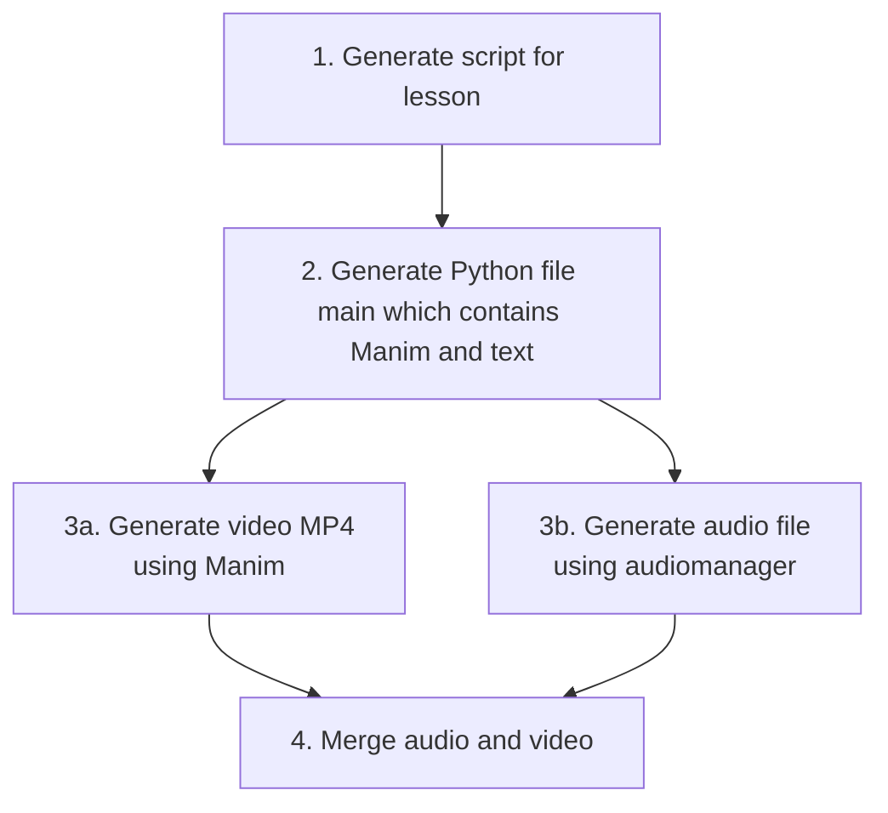

# AI Courses

## Pipeline Overview

```mermaid
flowchart TD
    A[1. Generate script for lesson] --> B[2. Generate Python file main which contains Manim and text]
    B --> C[3a. Generate video MP4<br>using Manim]
    B --> D[3b. Generate audio file<br>using audiomanager]
    C --> E[4. Merge audio and video]
    D --> E
```
