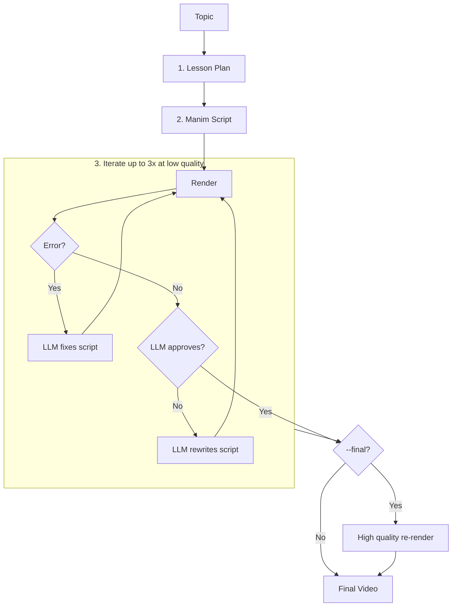

# AI Courses

Automated pipeline for generating educational math videos using AI and Manim.

## Setup

```bash
uv sync
```

> **One-time extra setup for the Kokoro engine** (uv venvs don't ship `pip` by default):
> ```bash
> uv pip install pip
> uv pip install "https://github.com/explosion/spacy-models/releases/download/en_core_web_sm-3.8.0/en_core_web_sm-3.8.0-py3-none-any.whl"
> ```

Create `.env`:
```env
# Required
OPENROUTER_API_KEY=your_key_here

# TTS engine: "kokoro" (fast, local) | "qwen" (local GPU) | "piper" (fast CPU)
TTS_ENGINE=kokoro

# Qwen TTS overrides (all optional)
QWEN_TTS_MODEL=Qwen/Qwen3-TTS-12Hz-1.7B-Base
QWEN_TTS_LANGUAGE=English
# Base / voice-clone model — optional path to a reference .wav for voice cloning
# (falls back to the bundled src/tts/clone.wav if not set):
QWEN_TTS_REF_AUDIO=
# Optional transcript of the reference audio (improves clone quality):
QWEN_TTS_REF_TEXT=

# Piper TTS model path override (optional)
PIPER_MODEL=models/en_US-ryan-high.onnx

# Kokoro TTS overrides (all optional)
KOKORO_VOICE=am_adam          # see kokoro docs for available voices
KOKORO_LANG_CODE=a            # a=American EN, b=British EN, j=Japanese …
KOKORO_SPEED=1.2

# Output directory for audio clips and merged audio
AUDIO_OUTPUT_DIR=.cache/audio

# AudioManager log verbosity during Manim render (0 = quiet, 1 = verbose)
# The workflow forces this to 0 while compiling so terminal output stays clean.
AUDIO_MANAGER_VERBOSE=1
```

## Usage

```bash
uv run lesson "LU Decomposition"
uv run lesson "Fourier Transform" --input-dir ./slides
uv run lesson "QR Decomposition" --final
uv run lesson "QR Decomposition" --model anthropic/claude-sonnet-4-5
```

## Text-to-Speech

Audio narration is generated locally. Three engines are available, selected via `TTS_ENGINE`:

| Engine | Model | Notes |
|--------|-------|-------|
| `kokoro` | hexgrad/Kokoro-82M | Fast, high quality, no GPU needed |
| `qwen` | Qwen/Qwen3-TTS-12Hz-1.7B-Base | GPU recommended; uses bundled `src/tts/clone.wav` for voice cloning by default (override with `QWEN_TTS_REF_AUDIO`) |
| `piper` | en_US-ryan-high | Fastest, fully offline |

```bash
# optional: FlashAttention 2 for lower VRAM usage on CUDA (Qwen only)
uv run pip install flash-attn --no-build-isolation
```

## Tests

```bash
uv run pytest                                          # all tests
uv run pytest -m integration                           # end-to-end only
uv run pytest tests/test_audiomanager.py               # single file
```

## Linting

```bash
uv run ruff check && uv run pyright   # both together
uv run ruff check                     # ruff only
uv run pyright                        # pyright only
```

## Pipeline Overview



## Configuration

The model used for both lesson planning and Manim script generation is set via `--model` (default: `google/gemini-3.1-pro-preview`). All other settings are configured via `.env` as shown in Setup.

## TODOs
- Add RAG search for previous exam problems
- Correlate colors with calculations
